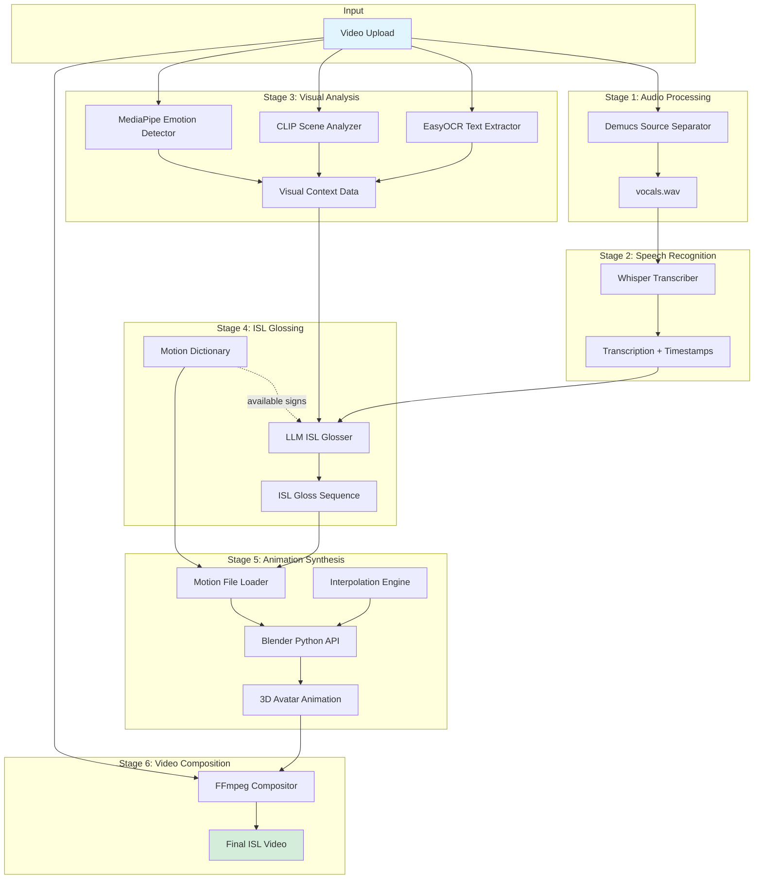

# Design Document: MudraAI

## Overview

MudraAI is a modular, microservices-based pipeline that transforms short-form video content into Indian Sign Language (ISL) interpreted videos without requiring human interpreters. The system leverages state-of-the-art AI models for audio processing, speech recognition, and visual analysis, combined with constraint-based LLM reasoning and 3D animation synthesis to generate natural sign language interpretations.

The architecture follows a six-stage pipeline design where each stage is independently deployable and testable:

1. **Audio Processing** - Isolates human speech using Demucs
2. **Speech Recognition** - Transcribes Hinglish content using Whisper
3. **Visual Analysis** - Extracts context using EasyOCR, CLIP, and MediaPipe
4. **ISL Glossing** - Converts text to ISL grammar using LLM with dictionary constraints
5. **Animation Synthesis** - Generates 3D avatar animations using Blender
6. **Video Composition** - Combines avatar with original video using FFmpeg

The system is designed for local execution with optional cloud LLM integration, ensuring data privacy and cost efficiency.

## Architecture

### System Architecture Diagram



### Microservices Architecture

Each pipeline stage is implemented as an independent service with well-defined interfaces:

- **Audio Service**: Handles audio extraction and source separation
- **Transcription Service**: Manages speech-to-text conversion
- **Vision Service**: Processes visual content analysis
- **Glossing Service**: Converts text to ISL grammar with LLM
- **Animation Service**: Generates 3D avatar animations
- **Composition Service**: Produces final video output
- **Orchestrator Service**: Coordinates pipeline execution and error handling

Services communicate via message queues (e.g., RabbitMQ or Redis) for asynchronous processing and can be scaled independently based on workload.

## Components and Interfaces

### 1. Audio Processor Component

**Technology**: Demucs (Meta AI's source separation model)

**Interface**:
```python
class AudioProcessor:
    def separate_audio(video_path: str) -> AudioSeparationResult:
        """
        Separates audio into vocal and non-vocal tracks.
        
        Args:
            video_path: Path to input video file
            
        Returns:
            AudioSeparationResult containing:
                - vocals_path: Path to isolated vocals.wav
                - background_path: Path to background audio
                - sample_rate: Audio sample rate
                - duration: Audio duration in seconds
                
        Raises:
            AudioProcessingError: If separation fails
        """
```

**Implementation Details**:
- Use Demucs v4 (htdemucs_ft model) for high-quality separation
- Extract audio from video using FFmpeg
- Process audio in chunks for memory efficiency
- Output 44.1kHz WAV format for compatibility

### 2. Speech Recognizer Component

**Technology**: OpenAI Whisper (large-v3 model for Hinglish support)

**Interface**:
```python
class SpeechRecognizer:
    def transcribe(audio_path: str, language_hint: str = "hi") -> TranscriptionResult:
        """
        Transcribes speech with word-level timestamps and speaker diarization.
        
        Args:
            audio_path: Path to vocals.wav file
            language_hint: Language code hint (default: "hi" for Hindi/Hinglish)
            
        Returns:
            TranscriptionResult containing:
                - segments: List of transcribed segments
                - words: List of words with start/end timestamps
                - speakers: Speaker identification labels
                - language: Detected language code
                - confidence: Overall confidence score
                
        Raises:
            TranscriptionError: If transcription fails
        """
```

**Implementation Details**:
- Use Whisper large-v3 model with Hindi language hint for Hinglish
- Enable word-level timestamps for precise synchronization
- Integrate pyannote.audio for speaker diarization
- Post-process to handle code-switching between Hindi and English
- Return confidence scores for quality assessment

### 3. Visual Analyzer Component

**Technologies**: EasyOCR, OpenAI CLIP, MediaPipe

**Interface**:
```python
class VisualAnalyzer:
    def analyze_video(video_path: str, sample_rate: int = 1) -> VisualContextResult:
        """
        Extracts visual context including text, scene, and emotions.
        
        Args:
            video_path: Path to input video file
            sample_rate: Frames per second to sample (default: 1 fps)
            
        Returns:
            VisualContextResult containing:
                - on_screen_text: List of detected text with timestamps
                - scene_descriptions: Scene context per frame
                - emotions: Detected emotions with timestamps
                - gestures: Detected gestures with timestamps
                
        Raises:
            VisualAnalysisError: If analysis fails
        """
    
    def extract_text(frame: np.ndarray) -> List[TextDetection]:
        """Extract text from a single frame using EasyOCR."""
    
    def analyze_scene(frame: np.ndarray) -> SceneContext:
        """Analyze scene context using CLIP."""
    
    def detect_emotions(frame: np.ndarray) -> EmotionData:
        """Detect facial expressions using MediaPipe Face Mesh."""
    
    def detect_gestures(frame: np.ndarray) -> GestureData:
        """Detect body gestures using MediaPipe Pose."""
```

**Implementation Details**:
- **EasyOCR**: Detect Hindi and English text in frames
- **CLIP**: Generate scene descriptions using zero-shot classification
- **MediaPipe Face Mesh**: Extract 468 facial landmarks for emotion detection
- **MediaPipe Pose**: Extract 33 body landmarks for gesture detection
- Sample frames at 1 fps to balance accuracy and performance
- Aggregate temporal data to identify sustained emotions/gestures

### 4. ISL Glosser Component

**Technology**: LLM (GPT-4o or local alternative like Llama 3)

**Interface**:
```python
class ISLGlosser:
    def __init__(self, motion_dictionary: MotionDictionary):
        """Initialize with motion dictionary for constraint enforcement."""
    
    def generate_gloss(
        transcription: TranscriptionResult,
        visual_context: VisualContextResult
    ) -> ISLGlossSequence:
        """
        Converts transcription to ISL Gloss grammar with dictionary constraints.
        
        Args:
            transcription: Transcribed text with timestamps
            visual_context: Visual context data
            
        Returns:
            ISLGlossSequence containing:
                - gloss_items: List of ISL signs with timing
                - motion_file_refs: References to motion dictionary files
                - facial_expressions: Expression cues for avatar
                - confidence: Confidence score for gloss quality
                
        Raises:
            GlossingError: If gloss generation fails
        """
    
    def build_constraint_prompt(
        text: str,
        available_signs: List[str],
        context: dict
    ) -> str:
        """Build LLM prompt with dictionary constraints."""
```

**Implementation Details**:
- Query motion dictionary to get list of available signs
- Construct LLM prompt with:
  - Input text and visual context
  - Available signs list
  - ISL grammar rules
  - Constraint: must use only available signs or fingerspelling
  - Examples of ISL Gloss format
- Parse LLM response to extract sign sequence
- Validate that all referenced signs exist in dictionary
- Fall back to fingerspelling for unavailable words
- Apply ISL grammar transformations:
  - Reorder words to match ISL syntax (e.g., time-topic-comment)
  - Add non-manual markers (facial expressions, head movements)
  - Handle questions with appropriate facial grammar

**LLM Prompt Template**:
```
You are an ISL (Indian Sign Language) expert. Convert the following text to ISL Gloss format.

CONSTRAINTS:
- You MUST only use signs from this available dictionary: {available_signs}
- If a word is not available, use a synonym from the dictionary
- If no synonym exists, use FINGERSPELL-{word}
- Follow ISL grammar rules (not English/Hindi word order)

INPUT TEXT: {transcription_text}
VISUAL CONTEXT: {scene_description}
EMOTIONS DETECTED: {emotions}

OUTPUT FORMAT:
Return a JSON array of gloss items:
[
  {"sign": "SIGN_NAME", "start_time": 0.0, "end_time": 1.2, "motion_file": "path/to/sign.json"},
  {"sign": "FINGERSPELL-WORD", "start_time": 1.2, "end_time": 2.0, "letters": ["W","O","R","D"]},
  ...
]

ISL GLOSS:
```

### 5. Motion Dictionary Component

**Technology**: JSON file storage with indexing

**Schema**:
```json
{
  "sign_id": "HELLO",
  "sign_name_english": "hello",
  "sign_name_hindi": "नमस्ते",
  "synonyms": ["greet", "namaste", "hi"],
  "category": "greeting",
  "motion_file": "signs/greeting/hello.json",
  "duration_ms": 1200,
  "keyframes": [
    {
      "timestamp_ms": 0,
      "landmarks": {
        "pose": [...],  // 33 MediaPipe pose landmarks (x, y, z)
        "left_hand": [...],  // 21 hand landmarks
        "right_hand": [...],  // 21 hand landmarks
        "face": [...]  // 468 face landmarks (optional)
      }
    },
    {
      "timestamp_ms": 400,
      "landmarks": {...}
    },
    ...
  ],
  "metadata": {
    "recorded_by": "interpreter_id",
    "date_added": "2024-01-15",
    "usage_count": 1523,
    "quality_score": 0.95
  }
}
```

**Interface**:
```python
class MotionDictionary:
    def __init__(self, dictionary_path: str):
        """Load and index motion dictionary."""
    
    def get_sign(self, sign_id: str) -> Optional[MotionData]:
        """Retrieve motion data for a specific sign."""
    
    def search_synonyms(self, word: str) -> List[MotionData]:
        """Find all signs matching a word or its synonyms."""
    
    def get_fingerspelling(self, letter: str) -> MotionData:
        """Get motion data for fingerspelling a letter."""
    
    def list_available_signs(self) -> List[str]:
        """Return list of all available sign IDs."""
    
    def validate_motion_file(self, motion_data: dict) -> bool:
        """Validate motion file against schema."""
```

**Implementation Details**:
- Store motion files in hierarchical directory structure by category
- Build in-memory index of sign_id → file_path mapping on startup
- Create inverted index for synonym search
- Validate all motion files on dictionary load
- Support hot-reloading when new signs are added
- Include fingerspelling alphabet (A-Z) as baseline

### 6. Animation Synthesizer Component

**Technology**: Blender Python API (bpy) with MakeHuman avatar and Mixamo rigging

**Interface**:
```python
class AnimationSynthesizer:
    def __init__(self, avatar_model_path: str):
        """Initialize Blender environment with 3D avatar."""
    
    def synthesize_animation(
        gloss_sequence: ISLGlossSequence,
        output_path: str,
        background: str = "transparent"
    ) -> AnimationResult:
        """
        Generate 3D avatar animation from ISL Gloss sequence.
        
        Args:
            gloss_sequence: ISL signs with timing
            output_path: Path for output video file
            background: "transparent" or "solid" background
            
        Returns:
            AnimationResult containing:
                - video_path: Path to rendered animation
                - duration: Animation duration in seconds
                - frame_rate: Video frame rate
                
        Raises:
            AnimationError: If synthesis fails
        """
    
    def load_motion_file(self, motion_file: str) -> BlenderAction:
        """Load motion data and convert to Blender action."""
    
    def interpolate_transitions(
        action1: BlenderAction,
        action2: BlenderAction,
        blend_frames: int = 5
    ) -> BlenderAction:
        """Smooth interpolation between two sign actions."""
    
    def apply_facial_expression(
        frame_range: Tuple[int, int],
        expression: str
    ):
        """Apply facial expression to avatar using shape keys."""
```

**Implementation Details**:
- Run Blender in headless mode (no GUI) for server deployment
- Use MakeHuman to generate base humanoid avatar model
- Apply Mixamo auto-rigging for skeletal animation
- Convert MediaPipe landmarks to Blender bone rotations:
  - Map 33 pose landmarks to avatar skeleton
  - Map 21 hand landmarks to finger bones
  - Map face landmarks to shape keys for expressions
- Chain motion actions sequentially on timeline
- Apply Bezier interpolation between actions (5-10 frames blend)
- Render at 30 fps with transparent background (PNG sequence or WebM with alpha)
- Use Cycles or Eevee renderer based on quality requirements

**Motion Data Conversion**:
```python
def mediapipe_to_blender(landmarks: List[Landmark], armature: bpy.types.Armature):
    """
    Convert MediaPipe 3D landmarks to Blender bone rotations.
    
    MediaPipe uses normalized coordinates (0-1 range).
    Blender uses world space coordinates and quaternion rotations.
    """
    # Map MediaPipe pose landmarks to Blender bones
    bone_mapping = {
        0: "head",  # nose
        11: "shoulder.L",  # left shoulder
        12: "shoulder.R",  # right shoulder
        13: "upper_arm.L",  # left elbow
        14: "upper_arm.R",  # right elbow
        15: "forearm.L",  # left wrist
        16: "forearm.R",  # right wrist
        # ... complete mapping
    }
    
    for landmark_idx, bone_name in bone_mapping.items():
        landmark = landmarks[landmark_idx]
        bone = armature.pose.bones[bone_name]
        
        # Convert position to rotation using inverse kinematics
        target_position = Vector((landmark.x, landmark.y, landmark.z))
        bone.rotation_quaternion = calculate_rotation(bone, target_position)
```

### 7. Video Compositor Component

**Technology**: FFmpeg / MoviePy

**Interface**:
```python
class VideoCompositor:
    def compose_video(
        original_video: str,
        avatar_animation: str,
        layout: str = "side-by-side",
        output_path: str = None
    ) -> CompositionResult:
        """
        Combine original video with ISL avatar animation.
        
        Args:
            original_video: Path to original video
            avatar_animation: Path to avatar animation
            layout: "side-by-side" or "picture-in-picture"
            output_path: Path for output video
            
        Returns:
            CompositionResult containing:
                - video_path: Path to final composed video
                - duration: Video duration
                - resolution: Output resolution
                
        Raises:
            CompositionError: If composition fails
        """
    
    def create_side_by_side(
        video1: str,
        video2: str,
        output: str
    ):
        """Create side-by-side layout."""
    
    def create_picture_in_picture(
        main_video: str,
        overlay_video: str,
        position: str,
        output: str
    ):
        """Create picture-in-picture layout with avatar overlay."""
```

**Implementation Details**:
- Use FFmpeg for high-performance video processing
- Synchronize videos based on timestamp data from transcription
- **Side-by-side layout**: Place original video on left, avatar on right
- **Picture-in-picture layout**: Overlay avatar in corner (configurable position)
- Preserve original audio track
- Output in MP4 format (H.264 codec) for social media compatibility
- Support resolution scaling to match platform requirements (1080x1920 for Reels)

**FFmpeg Command Examples**:
```bash
# Side-by-side
ffmpeg -i original.mp4 -i avatar.webm \
  -filter_complex "[0:v][1:v]hstack=inputs=2[v]" \
  -map "[v]" -map 0:a \
  -c:v libx264 -c:a copy output.mp4

# Picture-in-picture (avatar in bottom-right)
ffmpeg -i original.mp4 -i avatar.webm \
  -filter_complex "[1:v]scale=480:640[avatar];[0:v][avatar]overlay=W-w-10:H-h-10[v]" \
  -map "[v]" -map 0:a \
  -c:v libx264 -c:a copy output.mp4
```

### 8. Pipeline Orchestrator Component

**Interface**:
```python
class PipelineOrchestrator:
    def __init__(self, config: PipelineConfig):
        """Initialize all pipeline components."""
    
    def process_video(
        video_path: str,
        layout: str = "side-by-side"
    ) -> PipelineResult:
        """
        Execute complete pipeline from video upload to final output.
        
        Args:
            video_path: Path to input video
            layout: Output video layout
            
        Returns:
            PipelineResult containing:
                - output_video_path: Path to final ISL video
                - processing_time: Total processing time
                - stage_results: Results from each pipeline stage
                
        Raises:
            PipelineError: If any stage fails
        """
    
    def validate_input(self, video_path: str) -> bool:
        """Validate input video format and size."""
    
    def get_status(self, job_id: str) -> PipelineStatus:
        """Get current status of a processing job."""
```

**Implementation Details**:
- Validate input video format (MP4, MOV, WebM)
- Execute stages sequentially with error handling
- Store intermediate results for debugging
- Provide progress updates via callback or message queue
- Implement timeout handling (10 minutes for 60-second video)
- Support job queuing for concurrent requests
- Clean up temporary files after completion

## Data Models

### AudioSeparationResult
```python
@dataclass
class AudioSeparationResult:
    vocals_path: str
    background_path: str
    sample_rate: int
    duration: float
    separation_quality: float  # 0-1 score
```

### TranscriptionResult
```python
@dataclass
class Word:
    text: str
    start: float
    end: float
    confidence: float

@dataclass
class Segment:
    text: str
    start: float
    end: float
    words: List[Word]
    speaker: str

@dataclass
class TranscriptionResult:
    segments: List[Segment]
    language: str
    confidence: float
```

### VisualContextResult
```python
@dataclass
class TextDetection:
    text: str
    timestamp: float
    bbox: Tuple[int, int, int, int]
    confidence: float

@dataclass
class SceneContext:
    timestamp: float
    description: str
    confidence: float

@dataclass
class EmotionData:
    timestamp: float
    emotion: str  # happy, sad, surprised, neutral, etc.
    intensity: float

@dataclass
class GestureData:
    timestamp: float
    gesture_type: str
    landmarks: List[Tuple[float, float, float]]

@dataclass
class VisualContextResult:
    on_screen_text: List[TextDetection]
    scene_descriptions: List[SceneContext]
    emotions: List[EmotionData]
    gestures: List[GestureData]
```

### ISLGlossSequence
```python
@dataclass
class GlossItem:
    sign: str
    start_time: float
    end_time: float
    motion_file: str
    facial_expression: Optional[str] = None
    non_manual_markers: Optional[Dict[str, Any]] = None

@dataclass
class ISLGlossSequence:
    gloss_items: List[GlossItem]
    confidence: float
    total_duration: float
```

### MotionData
```python
@dataclass
class Landmark:
    x: float
    y: float
    z: float
    visibility: float

@dataclass
class Keyframe:
    timestamp_ms: int
    pose_landmarks: List[Landmark]  # 33 points
    left_hand_landmarks: List[Landmark]  # 21 points
    right_hand_landmarks: List[Landmark]  # 21 points
    face_landmarks: Optional[List[Landmark]] = None  # 468 points

@dataclass
class MotionData:
    sign_id: str
    sign_name_english: str
    sign_name_hindi: str
    synonyms: List[str]
    category: str
    motion_file: str
    duration_ms: int
    keyframes: List[Keyframe]
    metadata: Dict[str, Any]
```

## Correctness Properties

*A property is a characteristic or behavior that should hold true across all valid executions of a system—essentially, a formal statement about what the system should do. Properties serve as the bridge between human-readable specifications and machine-verifiable correctness guarantees.*


### Property Reflection

After analyzing all acceptance criteria, I've identified the following redundancies to eliminate:

**Redundancies identified:**
- Properties 2.1 and 2.5 both test transcription output structure - can be combined
- Properties 3.2, 3.3, 3.4, and 3.5 all test visual analysis output structure - can be combined into one comprehensive property
- Properties 5.1 and 5.2 both test motion file structure - can be combined
- Properties 12.1, 12.3, and 12.4 all test motion file validation - can be combined into one comprehensive validation property
- Properties 7.2 and 7.3 are specific examples of layout support - keep as examples, not properties
- Properties 6.1 and 6.4 both test animation output - can be combined

**Properties to keep as comprehensive tests:**
- Audio separation output structure (1.1, 1.2 combined)
- Error handling across components (1.4, 6.5, 8.2 combined pattern)
- Dictionary constraint enforcement (4.2, 4.3, 4.4 form a logical chain)
- Pipeline orchestration (8.1, 8.3, 8.4 combined)

### Audio Processing Properties

**Property 1: Audio separation produces valid output structure**
*For any* valid video file with audio, when audio separation is performed, the output should contain a vocals.wav file and a background audio file, both with valid audio format and matching duration to the source.
**Validates: Requirements 1.1, 1.2**

**Property 2: Audio separation error handling**
*For any* invalid or corrupted audio input, the Audio_Processor should return a specific error message indicating the failure reason rather than crashing or producing empty output.
**Validates: Requirements 1.4**

### Speech Recognition Properties

**Property 3: Transcription output completeness**
*For any* valid audio input, the transcription output should contain all required fields: text segments, word-level timestamps, speaker labels, language code, and confidence scores.
**Validates: Requirements 2.1, 2.4, 2.5**

### Visual Analysis Properties

**Property 4: Visual analysis output structure**
*For any* video file, when visual analysis is performed, the output should contain structured data for all analysis types: on-screen text detections (with bounding boxes and timestamps), scene descriptions (with timestamps), emotion data (with timestamps and intensity), and gesture data (with timestamps and landmarks).
**Validates: Requirements 3.2, 3.3, 3.4, 3.5**

### ISL Glossing Properties

**Property 5: Gloss output structure**
*For any* transcribed text input, the ISL Glosser should produce a gloss sequence containing sign identifiers, timing information, and motion file references for each gloss item.
**Validates: Requirements 4.1, 4.6**

**Property 6: Dictionary constraint enforcement**
*For any* generated ISL Gloss sequence, every sign reference should either exist in the Motion_Dictionary, be a valid synonym of an existing sign, or be a fingerspelling sequence.
**Validates: Requirements 4.2, 4.3, 4.4**

**Property 7: Question facial expression markers**
*For any* input text containing question patterns (who, what, when, where, why, how, or question marks), the generated gloss should include facial expression markers appropriate for ISL question grammar.
**Validates: Requirements 11.3**

**Property 8: Negation non-manual markers**
*For any* input text containing negation patterns (not, no, never, etc.), the generated gloss should include non-manual markers (head movements) appropriate for ISL negation grammar.
**Validates: Requirements 11.4**

### Motion Dictionary Properties

**Property 9: Motion dictionary lookup consistency**
*For any* valid sign ID in the dictionary, querying for that sign should return the corresponding motion file path and complete metadata.
**Validates: Requirements 5.3**

**Property 10: Synonym search completeness**
*For any* word that has multiple synonym entries in the dictionary, querying for synonyms should return all signs that list that word as a synonym.
**Validates: Requirements 5.4**

**Property 11: Motion file schema validation**
*For any* motion file added to the dictionary, it should conform to the MediaPipe 3D landmark schema including: all required body landmarks (33 pose, 21 per hand), timing information for each keyframe, and required metadata fields (sign_id, sign_name, duration_ms).
**Validates: Requirements 5.1, 5.2, 12.1, 12.3, 12.4**

**Property 12: Invalid motion file rejection**
*For any* motion file that fails schema validation, the Motion_Dictionary should reject the file and return specific validation errors indicating which fields are missing or malformed.
**Validates: Requirements 12.2**

### Animation Synthesis Properties

**Property 13: Animation generation completeness**
*For any* valid ISL Gloss sequence, the Animation_Synthesizer should produce a video file containing the 3D avatar animation with duration matching the gloss sequence timing and including all specified signs in order.
**Validates: Requirements 6.1, 6.4**

**Property 14: Facial expression application**
*For any* gloss sequence containing facial expression markers, the generated animation should include corresponding facial expressions applied to the avatar at the specified timestamps.
**Validates: Requirements 6.3**

**Property 15: Animation synthesis error handling**
*For any* invalid gloss sequence or missing motion files, the Animation_Synthesizer should return a specific error message indicating the failure reason.
**Validates: Requirements 6.5**

### Video Composition Properties

**Property 16: Video synchronization**
*For any* pair of videos (original and avatar animation), the composed output should have duration equal to the maximum of the two input durations, with both videos synchronized based on timestamp data.
**Validates: Requirements 7.1**

**Property 17: Output format compliance**
*For any* composed video, the output file should be in MP4 format with H.264 video codec, compatible with social media platform requirements.
**Validates: Requirements 7.4**

**Property 18: Audio preservation**
*For any* original video containing an audio track, the composed output should contain the same audio track with matching duration and quality.
**Validates: Requirements 7.5**

### Pipeline Orchestration Properties

**Property 19: Sequential stage execution**
*For any* valid video input, the pipeline should execute all six stages in order (Audio Processing → Speech Recognition → Visual Analysis → ISL Glossing → Animation Synthesis → Video Composition) and produce a final output video.
**Validates: Requirements 8.1, 8.3**

**Property 20: Pipeline error propagation**
*For any* pipeline execution where a stage fails, the system should halt processing immediately, not execute subsequent stages, and return an error message identifying which stage failed and why.
**Validates: Requirements 8.2**

**Property 21: Status update emission**
*For any* pipeline execution in progress, the system should emit status updates indicating the current stage name at the start of each stage.
**Validates: Requirements 8.4**

**Property 22: Input format validation**
*For any* uploaded file, the system should validate the file format before starting pipeline execution, accepting only supported video formats (MP4, MOV, WebM) and rejecting others with a clear error message.
**Validates: Requirements 8.5**

**Property 23: Request queuing under resource constraints**
*For any* system state where resources are constrained (CPU/memory above threshold), new processing requests should be added to a queue and processed sequentially rather than being rejected.
**Validates: Requirements 9.3**

**Property 24: Timeout enforcement**
*For any* processing request that exceeds the configured timeout limit, the system should terminate the request, clean up resources, and return a timeout error to the user.
**Validates: Requirements 9.4**

## Error Handling

### Error Categories

The system defines four categories of errors with specific handling strategies:

1. **Input Validation Errors** (4xx-style)
   - Invalid file format
   - Corrupted video/audio
   - Unsupported language
   - File size exceeds limits
   - **Handling**: Return immediately with clear error message, do not process

2. **Processing Errors** (5xx-style)
   - Audio separation failure
   - Transcription failure
   - Animation rendering failure
   - **Handling**: Log detailed error, return user-friendly message, clean up partial results

3. **Resource Errors**
   - Out of memory
   - Disk space exhausted
   - Timeout exceeded
   - **Handling**: Terminate gracefully, release resources, queue for retry if applicable

4. **Dictionary Constraint Errors**
   - Sign not found in dictionary
   - Motion file corrupted
   - Schema validation failure
   - **Handling**: Fall back to fingerspelling or synonyms, log warning

### Error Response Format

All errors follow a consistent JSON structure:

```json
{
  "error": {
    "code": "AUDIO_SEPARATION_FAILED",
    "message": "Failed to separate audio sources",
    "stage": "audio_processing",
    "details": {
      "reason": "Input audio is corrupted or empty",
      "timestamp": "2024-01-15T10:30:00Z",
      "job_id": "abc123"
    },
    "recoverable": false
  }
}
```

### Retry Logic

- **Transient failures**: Retry up to 3 times with exponential backoff (1s, 2s, 4s)
- **Resource constraints**: Queue for later processing
- **Permanent failures**: Do not retry, return error immediately

### Partial Results

When a pipeline stage fails, the system preserves intermediate results for debugging:
- Audio separation outputs (vocals.wav, background.wav)
- Transcription JSON
- Visual analysis JSON
- ISL Gloss JSON

These are stored temporarily (24 hours) and can be accessed via job ID for troubleshooting.

## Testing Strategy

### Dual Testing Approach

MudraAI requires both unit testing and property-based testing for comprehensive coverage:

- **Unit tests**: Verify specific examples, edge cases, and integration points
- **Property tests**: Verify universal properties across randomized inputs

Both testing approaches are complementary and necessary. Unit tests catch concrete bugs in specific scenarios, while property tests verify general correctness across a wide input space.

### Property-Based Testing Configuration

**Library Selection**:
- **Python**: Use `hypothesis` library for property-based testing
- **Configuration**: Minimum 100 iterations per property test
- **Tagging**: Each property test must reference its design document property

**Tag Format**:
```python
@given(video_file=video_strategy())
@settings(max_examples=100)
def test_audio_separation_output_structure(video_file):
    """
    Feature: mudra-ai, Property 1: Audio separation produces valid output structure
    
    For any valid video file with audio, when audio separation is performed,
    the output should contain a vocals.wav file and a background audio file,
    both with valid audio format and matching duration to the source.
    """
    # Test implementation
```

### Unit Testing Focus Areas

Unit tests should focus on:

1. **Specific Examples**:
   - Known Hinglish phrases with expected transcriptions
   - Specific ISL grammar transformations (e.g., "I am going tomorrow" → "TOMORROW I GO")
   - Sample videos with known on-screen text

2. **Edge Cases**:
   - Empty audio (silence)
   - Single-frame videos
   - Videos with no speech
   - Extremely short videos (<1 second)
   - Videos with only background music

3. **Integration Points**:
   - Pipeline stage handoffs
   - Data format conversions (MediaPipe → Blender)
   - File I/O operations
   - External API calls (LLM, Whisper)

4. **Error Conditions**:
   - Corrupted video files
   - Missing motion dictionary files
   - Invalid JSON in motion files
   - Timeout scenarios

### Property-Based Testing Focus Areas

Property tests should verify:

1. **Data Structure Invariants**:
   - All outputs contain required fields
   - Timestamps are monotonically increasing
   - Durations match across pipeline stages

2. **Dictionary Constraints**:
   - All sign references exist in dictionary
   - Synonym lookups return valid signs
   - Fingerspelling fallback works for any word

3. **Round-Trip Properties**:
   - Motion file serialization/deserialization
   - Video composition preserves audio

4. **Error Handling**:
   - Invalid inputs produce errors (not crashes)
   - Errors contain specific failure information

### Test Data Requirements

**Motion Dictionary**:
- Minimum 100 common ISL signs for testing
- Complete fingerspelling alphabet (A-Z)
- At least 5 signs per category (greetings, numbers, questions, etc.)

**Video Test Corpus**:
- 10 sample videos with Hinglish speech
- 5 videos with on-screen text
- 5 videos with clear facial expressions
- 3 videos with multiple speakers

**Ground Truth Data**:
- Manual transcriptions for accuracy testing
- Expert-validated ISL Gloss sequences
- Reference animations for quality comparison

### Performance Testing

While not part of automated testing, performance benchmarks should be established:

- **Baseline**: 60-second video processed in <10 minutes on standard hardware
- **Hardware spec**: 8-core CPU, 16GB RAM, GPU optional
- **Bottleneck identification**: Profile each pipeline stage
- **Optimization targets**: Audio separation (30%), Animation rendering (40%)

### Integration Testing

End-to-end integration tests should verify:

1. Complete pipeline execution with real videos
2. Error recovery and retry logic
3. Concurrent request handling
4. Resource cleanup after processing
5. Status update accuracy

### Continuous Integration

- Run unit tests on every commit
- Run property tests (100 iterations) on every PR
- Run integration tests nightly
- Performance benchmarks weekly
- Update test corpus monthly with new ISL signs
